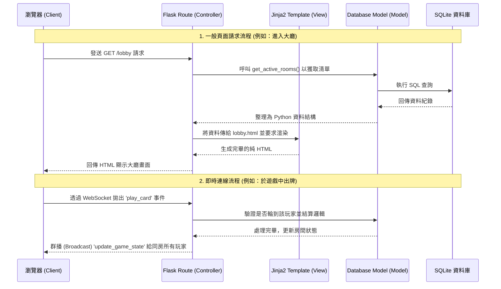

# 系統架構設計 (Architecture)

本文件基於 `docs/PRD.md` 的需求，規劃線上桌遊系統的整體技術架構、資料夾結構與系統元件關係，作為後續開發的指引。

---

## 1. 技術架構說明

根據線上桌遊的需求，我們採用基於 MVC (Model-View-Controller) 架構的 Flask 應用程式。

### 選用技術與原因
- **後端：Python + Flask**
  - **原因**：Flask 是輕量級且高彈性的網頁框架，適合初學者與快速原型開發。我們需要靈活設計遊戲狀態同步的 API，Flask 能夠簡單且快速地滿足此需求。
- **即時通訊：Flask-SocketIO (WebSocket)**
  - **原因**：桌遊的狀態同步與文字聊天需要極低的延遲（即時同步玩家出牌、加入房間等行為）。傳統的單向 HTTP 請求無法輕易實現雙向溝通，而 WebSocket 能讓伺服器主動發送資料給用戶端。
- **前端渲染模板：Jinja2**
  - **原因**：與 Flask 原生完美整合，能直接在伺服器端將資料注入 HTML 中產生頁面，降低前期的開發門檻，免去處理繁瑣的前後端分離與跨域問題。
- **資料庫：SQLite (搭配 SQLAlchemy 或內建 sqlite3)**
  - **原因**：隨開即用，不需額外安裝與設定資料庫伺服器，非常適合小型專案、開發階段或是輕量級 MVP 使用。

### Flask MVC 模式說明
本專案不採用所謂的絕對嚴格框架限制，但核心邏輯參考 MVC 三個職責劃分：
- **Model (模型)**：負責與 SQLite 資料庫溝通，定義如 `User` (會員)、`Room` (房間) 等資料結構與存取邏輯。
- **View (視圖)**：負責呈現使用者介面。為 `templates/` 資料夾下的 Jinja2 HTML 檔案，與 `static/` 下的 CSS/JS 檔案。
- **Controller (控制器)**：負責接收瀏覽器的請求並進行邏輯處理。由 Flask 的 `routes/` 負責，扮演中介角色，從 Model 拉取資料，並注入給 View 渲染。

---

## 2. 專案資料夾結構

本專案預計依照功能模組進行劃分，避免所有程式碼擠在同一個檔案內。建議的目錄結構如下：

```text
web_app_development/
│
├── app/                      # 應用程式的核心功能資料夾
│   ├── models/               # [Model] 資料庫模型與邏輯
│   │   ├── __init__.py
│   │   ├── user.py           # 負責會員帳號與權限的邏輯
│   │   ├── room.py           # 負責大廳房間狀態與紀錄
│   │   └── game.py           # 桌遊核心邏輯模組
│   │
│   ├── routes/               # [Controller] URL 路由
│   │   ├── __init__.py
│   │   ├── auth_routes.py    # 處理註冊、登入與登出
│   │   ├── lobby_routes.py   # 處理建立房間與瀏覽大廳
│   │   ├── game_routes.py    # 處理遊戲的基礎 HTTP 功能
│   │   └── socket_events.py  # 處理 WebSocket 雙向事件發送/接收
│   │
│   ├── templates/            # [View] Jinja2 HTML 模板
│   │   ├── base.html         # 共用樣板 (負責引導外部資源與導覽列)
│   │   ├── index.html        # 首頁 (含登入/註冊表單)
│   │   ├── lobby.html        # 遊戲大廳頁面
│   │   └── room.html         # 房間內部與遊戲畫面
│   │
│   └── static/               # [View] 靜態資源檔案
│       ├── css/
│       │   └── style.css     # 樣式表
│       ├── js/
│       │   ├── main.js       # 共用互動邏輯
│       │   └── room.js       # 房間內的 Socket 連線與遊戲畫面更新
│       └── images/           # 素材圖片
│
├── instance/                 # 放置不應加入 Git 的本地端檔案
│   └── database.db           # SQLite 資料庫主檔案
│
├── docs/                     # 專案文件存放區
│   ├── PRD.md                # 產品需求文件
│   └── ARCHITECTURE.md       # 本架構文件
│
├── requirements.txt          # Python 依賴套件表
└── app.py                    # 專案啟動入口 (綁定路由並啟動伺服器)
```

---

## 3. 元件關係圖

以下展示各端點與元件之間是如何溝通互動的流程：



---

## 4. 關鍵設計決策

1. **採用 WebSocket (Flask-SocketIO) 處理遊戲機制**
   - **決策重點**：因為需要讓玩家即時得知對手的動作與傳送聊天訊息，捨棄不斷重新整理頁面及短輪詢 (Short Polling) 這些消耗資源的作法，改為建立 WebSocket 持久連線。
2. **伺服器端渲染 (SSR) 搭配局部 JS 更新**
   - **決策重點**：為了專案的實作效率，基本的頁面（例如登入與大廳列表）都由 Jinja2 渲染完整的 HTML 後傳回。只有「進入房間後」的遊戲過程，才會大量依賴 Vanilla JavaScript 與 SocketIO 來即時抽換與改變畫面。
3. **明確拆分目錄而不把全部程式寫在 app.py**
   - **決策重點**：由於線上桌遊可能同時含有聊天、房間管理與核心遊戲邏輯，若堆積在單一檔案內將大幅提高開發障礙。利用 `routes/` 及 `models/` 來進行所謂的「藍圖 (Blueprints)」式分層，確保職責單一。
4. **依靠 Session 機制防作弊**
   - **決策重點**：所有的 HTTP API 以及 Socket 互動事件，都會由後端去查驗儲存在 Flask Session 中的 `user_id`。這能保護玩家身份，防止有人竄改前端資料冒充對手來惡意出牌。
