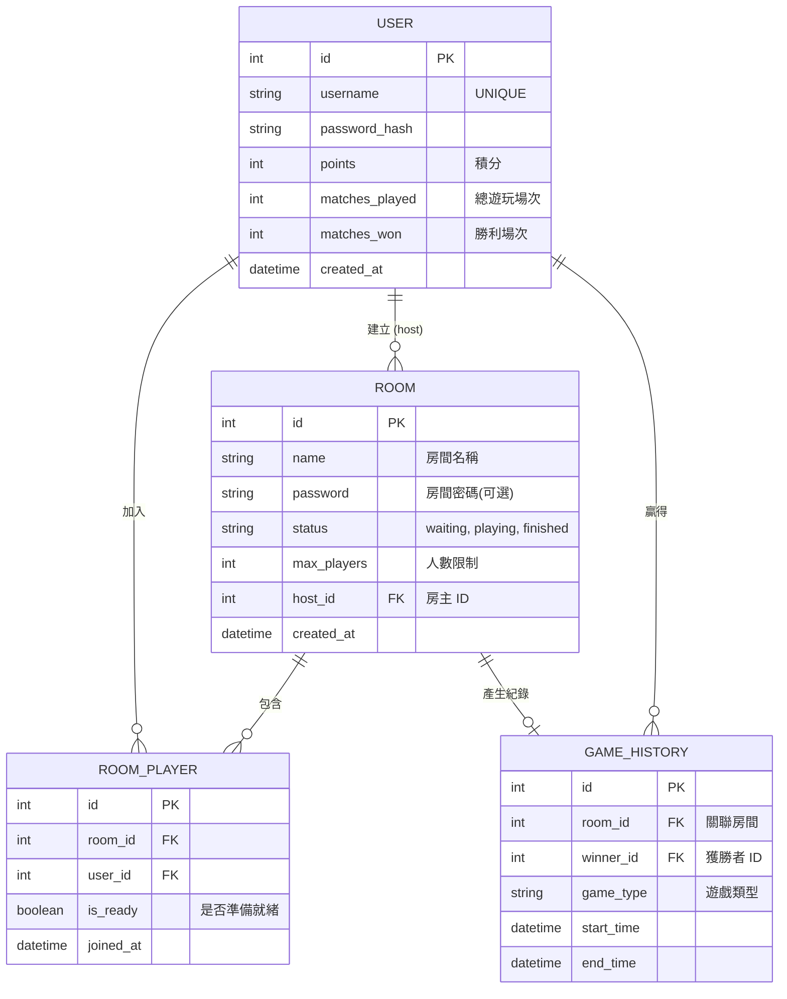

# 資料庫設計文件 (DB Design)

## 1. ER 圖（實體關係圖）

## 2. 資料表詳細說明

### USER (會員資料表)
記錄使用者的帳號登入資訊與全服成績。
- `id` (INTEGER): 主鍵 (Primary Key, Autoincrement)
- `username` (TEXT): 帳號名稱，必須唯一 (Unique)、必填
- `password_hash` (TEXT): 安全加密後的密碼，必填
- `points` (INTEGER): 遊戲積分，預設 0。用於排行榜
- `matches_played` (INTEGER): 累積遊玩局數，預設 0
- `matches_won` (INTEGER): 累積獲勝局數，預設 0
- `created_at` (DATETIME): 帳號建立時間

### ROOM (遊戲大廳房間表)
記錄大廳中房間的狀態與基礎設定。
- `id` (INTEGER): 主鍵
- `name` (TEXT): 房間顯示名稱，必填
- `password` (TEXT): 密碼，若為空或 Null 代表公開房間
- `status` (TEXT): 狀態 ('waiting': 等待中, 'playing': 遊戲中, 'finished': 結束)，預設 'waiting'
- `max_players` (INTEGER): 人數上限，預設可為 2 到 4 人
- `host_id` (INTEGER): 外鍵 (Foreign Key)，關聯至 `USER.id`，表示房主
- `created_at` (DATETIME): 房間建立時間

### ROOM_PLAYER (房間玩家關聯表)
記錄哪些玩家在哪些房間內，以及他們的準備狀態。
- `id` (INTEGER): 主鍵
- `room_id` (INTEGER): 外鍵，關聯至 `ROOM.id`
- `user_id` (INTEGER): 外鍵，關聯至 `USER.id`
- `is_ready` (BOOLEAN): 玩家是否已經按下準備 (0 或 1)
- `joined_at` (DATETIME): 加入時刻

### GAME_HISTORY (戰績歷史表)
記錄遊戲結束後的對局結果。
- `id` (INTEGER): 主鍵
- `room_id` (INTEGER): 外鍵，對應關聯的 `ROOM`
- `winner_id` (INTEGER): 外鍵，對應贏家 `USER.id`（若平手則可能為 Null 或是特定狀態）
- `game_type` (TEXT): 桌遊種類 (例如 'tictactoe' 九宮格)
- `start_time` (DATETIME): 遊戲開始時間
- `end_time` (DATETIME): 遊戲結束時間

