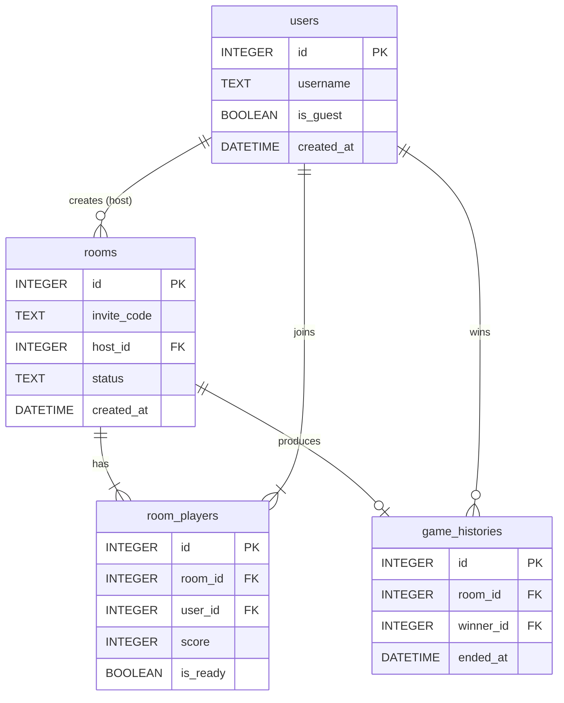

# 資料庫設計文件 (Database Design)

這份文件定義了桌遊系統的 SQLite 資料庫 Schema，包含資料表結構、欄位說明以及實體關係（ER 圖）。

## 1. ER 圖 (實體關係圖)

```mermaid
erDiagram
    users {
        INTEGER id PK
        TEXT username
        BOOLEAN is_guest
        DATETIME created_at
    }
    rooms {
        INTEGER id PK
        TEXT invite_code
        INTEGER host_id FK
        TEXT status
        DATETIME created_at
    }
    room_players {
        INTEGER id PK
        INTEGER room_id FK
        INTEGER user_id FK
        INTEGER score
        BOOLEAN is_ready
    }
    game_histories {
        INTEGER id PK
        INTEGER room_id FK
        INTEGER winner_id FK
        DATETIME ended_at
    }

    users ||--o{ rooms : "creates (host)"
    rooms ||--|{ room_players : "has"
    users ||--|{ room_players : "joins"
    rooms ||--o| game_histories : "produces"
    users ||--o{ game_histories : "wins"
```

## 2. 資料表詳細說明

### 2.1 `users` 資料表 (玩家)
儲存所有玩家的基本資訊，支援正式會員與臨時訪客。

| 欄位名稱 | 型別 | 說明 |
|---|---|---|
| `id` | INTEGER (PK) | 唯一識別碼，自動遞增 |
| `username` | TEXT | 玩家顯示名稱 / 暱稱 |
| `is_guest` | BOOLEAN | 是否為臨時訪客（1: 是, 0: 否） |
| `created_at` | DATETIME | 帳號建立時間（預設 CURRENT_TIMESTAMP） |

### 2.2 `rooms` 資料表 (房間)
儲存遊戲房間的狀態。

| 欄位名稱 | 型別 | 說明 |
|---|---|---|
| `id` | INTEGER (PK) | 房間唯一識別碼 |
| `invite_code` | TEXT | 房間專屬邀請碼（例如 6 碼英數） |
| `host_id` | INTEGER (FK) | 房主的 user_id |
| `status` | TEXT | 房間狀態：`waiting` (等待中), `playing` (遊戲中), `finished` (已結束) |
| `created_at` | DATETIME | 建立時間 |

### 2.3 `room_players` 資料表 (房間內玩家狀態)
記錄目前有哪些玩家在特定房間內，以及他們在該場遊戲中的即時狀態（如分數）。這是一個關聯表，處理 User 與 Room 之間的多對多關係。

| 欄位名稱 | 型別 | 說明 |
|---|---|---|
| `id` | INTEGER (PK) | 唯一識別碼 |
| `room_id` | INTEGER (FK) | 關聯的房間 ID |
| `user_id` | INTEGER (FK) | 關聯的玩家 ID |
| `score` | INTEGER | 該名玩家在該房間內的目前分數 (預設 0) |
| `is_ready` | BOOLEAN | 是否準備好開始遊戲 |

### 2.4 `game_histories` 資料表 (遊戲紀錄)
遊戲結束後產生的歷史戰績。

| 欄位名稱 | 型別 | 說明 |
|---|---|---|
| `id` | INTEGER (PK) | 紀錄唯一識別碼 |
| `room_id` | INTEGER (FK) | 是在哪個房間發生的遊戲 |
| `winner_id` | INTEGER (FK) | 獲勝者的 user_id |
| `ended_at` | DATETIME | 遊戲結束時間 |
