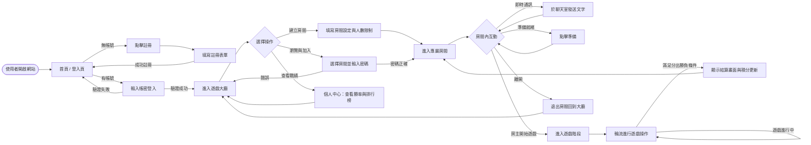
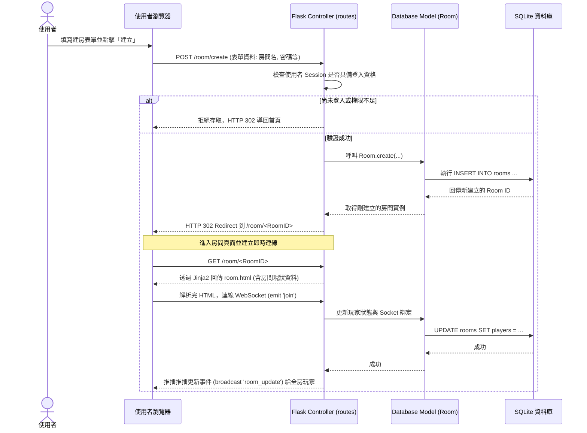

# 流程圖設計文件 (Flowchart)

本文件基於線上桌遊系統的需求說明 (PRD) 與系統架構 (ARCHITECTURE) 產出，以視覺化的方式呈現使用者的操作動線及系統的資料傳遞流程，確保前後端開發對齊邏輯。

---

## 1. 使用者流程圖 (User Flow)

此圖描述使用者從一開始打開網站後，直到註冊登入、瀏覽大廳、加入房間遊玩到最終查看戰績的一系列操作路徑。

---

## 2. 系統序列圖 (Sequence Diagram)

此序列圖描述 MVP 中最重要的核心邏輯之一：**使用者從大廳點擊「建立新房間」到資料庫建立資料，並順利進入房間** 的系統資料流通訊完整過程。

---

## 3. 功能清單對照表

統整系統所涵蓋的核心功能及其對應存取路徑，提供給前端介接與後端實作時參考。

| 功能區塊 | 子功能 | URL 路徑 | HTTP 方法 / WebSocket事件 | 說明 |
| :--- | :--- | :--- | :--- | :--- |
| **會員管理** | 註冊帳號 | `/register` | GET, POST | GET: 註冊頁，POST: 寫入帳號資料 |
| | 會員登入 | `/login` | GET, POST | POST: 驗證帳密並寫入 Session |
| | 會員登出 | `/logout` | GET | 清除 Session 並導回首頁 |
| | 個人中心 | `/profile` | GET | 顯示目前登入者的詳細戰績及排行榜 |
| **大廳與房間** | 瀏覽大廳 | `/lobby` | GET | 查詢所有啟用的房間清單 |
| | 建立房間 | `/room/create` | POST | 接收建立參數並寫入資料庫 |
| | 加入房間 | `/room/join/<id>`| POST | 驗證密碼後，將該房資料與玩家結合 |
| | 房間畫面 | `/room/<id>` | GET | 渲染特定房間之 UI 介面，準備建立 Socket |
| **即時遊戲機制**| 加入房間頻道 | `/room/<id>` | `emit('join')` | 處理玩家 Socket 加入 SocketIO 指定的房頻道 |
| | 即時通訊 | `/room/<id>` | `emit('chat_msg')` | 傳送訊息並由 Flask 透過 broadcast 推送給所有房客 |
| | 遊戲動作指令 | `/room/<id>` | `emit('game_action')` | 包含出牌、下棋等指令，驗證邏輯後推播更新盤面 |
