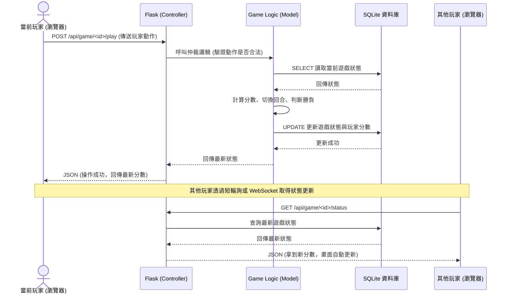

# 流程圖文件 (Flowchart Design)

這份文件基於 PRD 需求與系統架構，透過視覺化的圖表來說明使用者的操作路徑（User Flow），以及系統內部元件之間的資料流動（System Flow）。

## 1. 使用者流程圖 (User Flow)

這張圖展示了玩家從進入網站開始，到建立房間、進行遊戲、最後結算的完整操作路徑。

```mermaid
flowchart LR
    Start([使用者開啟網站]) --> Auth{是否有登入或\n設定訪客暱稱？}
    Auth -->|否| Login[登入 / 訪客設定頁面]
    Auth -->|是| Lobby[大廳主頁]
    
    Login --> Lobby
    
    Lobby --> Action{選擇動作}
    Action -->|查看個人紀錄| History[成就與戰績頁面]
    History --> Lobby
    Action -->|建立專屬房間| CreateRoom[建立新房間 (產生邀請碼)]
    Action -->|加入朋友房間| JoinRoom[輸入邀請碼加入]
    
    CreateRoom --> Room[遊戲房間等待區]
    JoinRoom --> Room
    
    Room -->|等待人數湊齊| Chat[房間內聊天/準備]
    Room -->|房主按下開始| Game[進入遊戲主畫面]
    
    Game --> GameLoop{遊戲進行中}
    GameLoop -->|輪到我的回合| Play[執行遊戲動作]
    GameLoop -->|他人回合| Wait[等待並觀看動態計分更新]
    Play --> CheckWin{智慧化仲裁}
    CheckWin -->|遊戲繼續| GameLoop
    CheckWin -->|遊戲結束| End[結算畫面\n(顯示最終分數與解鎖成就)]
    
    End -->|離開房間| Lobby
    End -->|再玩一局| Room
```

## 2. 系統序列圖 (System Sequence Diagram)

這張圖以「遊戲進行中，玩家執行一個動作（例如出牌或移動）」為例，展示前端瀏覽器、Flask Route、Model 與資料庫之間如何互動，以完成動態計分與狀態更新。

```mermaid
sequenceDiagram
    actor Player as 當前玩家 (瀏覽器)
    participant Route as Flask (Controller)
    participant Model as Game Logic (Model)
    participant DB as SQLite 資料庫
    participant Other as 其他玩家 (瀏覽器)

    Player->>Route: POST /api/game/<id>/play (傳送玩家動作)
    
    Route->>Model: 呼叫仲裁邏輯 (驗證動作是否合法)
    Model->>DB: SELECT 讀取當前遊戲狀態
    DB-->>Model: 回傳狀態
    
    Model->>Model: 計算分數、切換回合、判斷勝負
    
    Model->>DB: UPDATE 更新遊戲狀態與玩家分數
    DB-->>Model: 更新成功
    
    Model-->>Route: 回傳最新狀態
    Route-->>Player: JSON (操作成功，回傳最新分數)
    
    note over Player, Other: 其他玩家透過短輪詢或 WebSocket 取得狀態更新
    
    Other->>Route: GET /api/game/<id>/status
    Route->>DB: 查詢最新遊戲狀態
    DB-->>Route: 回傳最新狀態
    Route-->>Other: JSON (拿到新分數，畫面自動更新)
```

## 3. 功能清單與 URL 對照表

在接下來的實作中，我們預計會開發以下對應的路由與頁面：

| 功能分類 | 功能說明 | 預期 URL 路徑 | HTTP 方法 |
| :--- | :--- | :--- | :--- |
| **帳號/身分** | 登入或設定臨時訪客暱稱 | `/login` | GET / POST |
| **大廳** | 顯示大廳主畫面（建立/加入房間按鈕） | `/lobby` | GET |
| **大廳** | 查看個人的歷史紀錄與成就 | `/profile` | GET |
| **房間管理** | 處理建立房間的請求 | `/room/create` | POST |
| **房間管理** | 處理加入房間的請求 | `/room/join` | POST |
| **房間管理** | 顯示房間等待區畫面 | `/room/<room_id>` | GET |
| **遊戲** | 渲染遊戲主畫面（HTML/CSS/JS） | `/game/<room_id>` | GET |
| **遊戲 (API)** | 前端取得最新遊戲狀態與分數 | `/api/game/<room_id>/status` | GET |
| **遊戲 (API)** | 前端傳送玩家動作給後端仲裁 | `/api/game/<room_id>/play` | POST |
